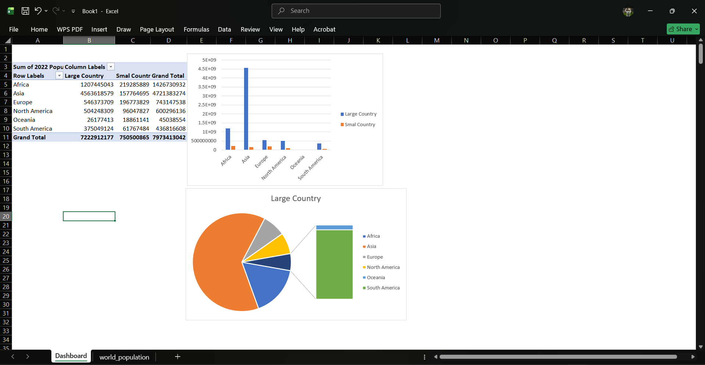
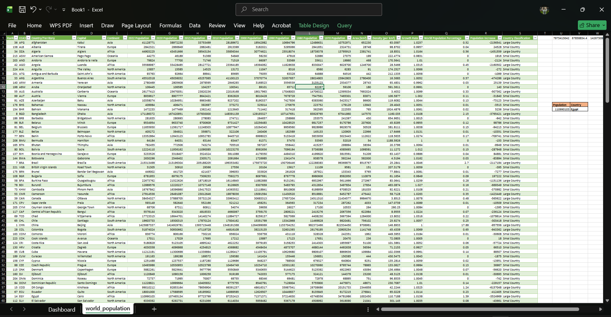

# 📊 Advanced Excel Data Analysis Portfolio

This repository serves as a comprehensive collection of my data analysis projects, where I leverage Microsoft Excel's advanced features to derive actionable insights. My focus is not just on data visualization, but on the entire data pipeline: from raw data extraction and cleaning to building professional, automated, and interactive business intelligence dashboards.

---

## 🚀 Featured Projects

### 1️⃣ World Population Analysis Dashboard 🌍
* **Project Overview:** A sophisticated demographic analytics project. I transformed raw population datasets into a dynamic decision-support dashboard to explore growth patterns across continents and track population shifts over time.
* **Analytical Workflow:**
  * **Data Enrichment:** Utilized **XLOOKUP** to perform complex cross-referencing and **IF-Logic** to categorize nations into "Large" or "Small" based on population density.
  * **Aggregated Insights:** Used **SUMIF & COUNTIF** to dynamically calculate regional contributions to total global figures.
  * **Statistical Modeling:** Leveraged the **MAX** function to identify demographic outliers and highest-growth clusters, providing a strategic view of global demographic trends.
* **Impact:** This dashboard enables users to quickly compare continental growth rates and visualize demographic distributions through interactive charts and pie visualizers.
* **Project Preview:**

---

### 2️⃣ Zomato vs Swiggy Sales Performance Analysis 🛒
* **Project Overview:** A deep-dive comparative business study. By processing transactional data from two industry giants, I uncovered critical performance metrics and customer purchasing behaviors that drive competitive advantage in the food-delivery sector.
* **Analytical Workflow:**
  * **Business Intelligence:** Built custom **Pivot Tables** to segment sales by region and platform.
  * **Trend Identification:** Applied **Conditional Formatting** to visually flag "Hotspots" (top-performing sales regions), which helps in optimizing marketing and delivery resource allocation.
* **Key Findings:** Successfully identified which platform leads in specific demographic segments, providing a blueprint for potential business scaling.
* **Project Preview:**

---

### 3️⃣ Netflix Data Cleaning & Quality Assurance 🎬
* **Project Overview:** A hands-on project dedicated to **Data Integrity**. Raw datasets are rarely "analysis-ready"; I applied professional cleaning protocols to transform unstructured data into a high-quality format suitable for reporting.
* **Analytical Workflow:**
  * **Consistency Protocol:** Automated the identification of null values in critical fields like `director` and `cast`, replacing them with "Not Given" to ensure complete data coverage.
  * **Redundancy Management:** Implemented systematic deduplication strategies using `show_id` to ensure no overlapping data points skew final results.
* **Impact:** Established a clean, robust, and reliable dataset that guarantees high-precision results for any future analysis or reporting.
* **Project Preview:**

---

## 🛠️ Skills & Technologies
* **Advanced Excel Functions:** XLOOKUP, SUMIF, COUNTIF, MAX, IF-Logic, Nested Functions.
* **Business Intelligence:** Pivot Table Architecture, Dynamic Dashboarding, Trend Analysis.
* **Data Methodology:** Structured Data Cleaning, Quality Assurance, and Business Metric Visualization.
