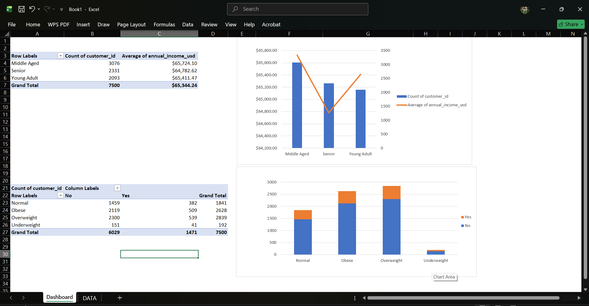
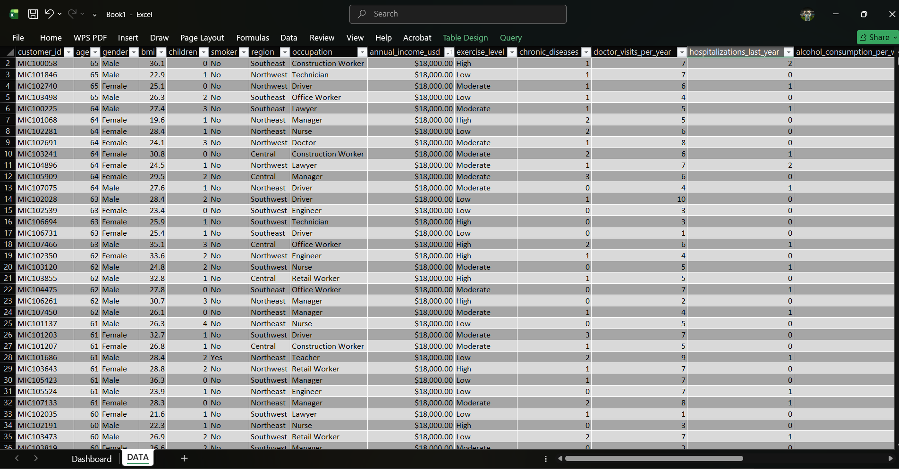

# 📊 Advanced Excel Data Analysis Portfolio

This repository showcases my expertise in using Microsoft Excel as a powerful data analysis tool. It highlights my ability to perform complex data cleaning, data modeling, and the creation of professional business dashboards.

---

## 🚀 Featured Projects

### 1️⃣ World Population Analysis Dashboard 🌍
* **Project Overview:** An analytical project based on the "World Population" dataset. I processed global demographic data to categorize countries and visualize population distribution across continents.
* **Excel Functions Used:** * **XLOOKUP:** For precise data retrieval and mapping.
  * **SUMIF & COUNTIF:** For aggregating population totals and frequency counting based on specific criteria.
  * **MAX:** To identify peak population metrics within regions.
  * **IF Logic:** For creating conditional categories (e.g., classifying countries as "Large" or "Small").
* **Key Features:** Built a comprehensive dashboard featuring bar charts and pie charts to compare population density and growth trends globally.
* **Project Preview:**

---

### 2️⃣ Zomato vs Swiggy Sales Performance Analysis 🛒
* **Project Overview:** A comparative analysis evaluating the sales performance and customer behavior of two major food delivery platforms.
* **Analytical Techniques:** Data Aggregation, Pivot Tables, and Advanced Formatting to highlight key sales drivers.
* **Project Preview:**

---

### 3️⃣ Netflix Data Cleaning Project 🎬
* **Project Overview:** Focused on the foundational stage of data analysis: **Data Cleaning**. Pre-processed raw datasets to ensure high data integrity for accurate reporting.
* **Cleaning Steps:** Handled missing values (`Not Given`) and performed deduplication.
* **Project Preview:**

---

### 4️⃣ Medical Analytics & Healthcare Dashboard 🏥
* **Project Overview:** Structured medical tracking records to build an insightful dashboard visualizing patient data and clinical performance trends.
* **Key Features:** Interactive design and automated health metric tracking.
* **Project Preview:**

---

## 🛠️ Skills & Technologies
* **Excel Core:** XLOOKUP, SUMIF, COUNTIF, MAX, IF, Pivot Tables, Conditional Formatting, Data Validation.
* **Methodology:** Data Cleaning, Trend Analysis, KPI Dashboarding, Business Intelligence.
