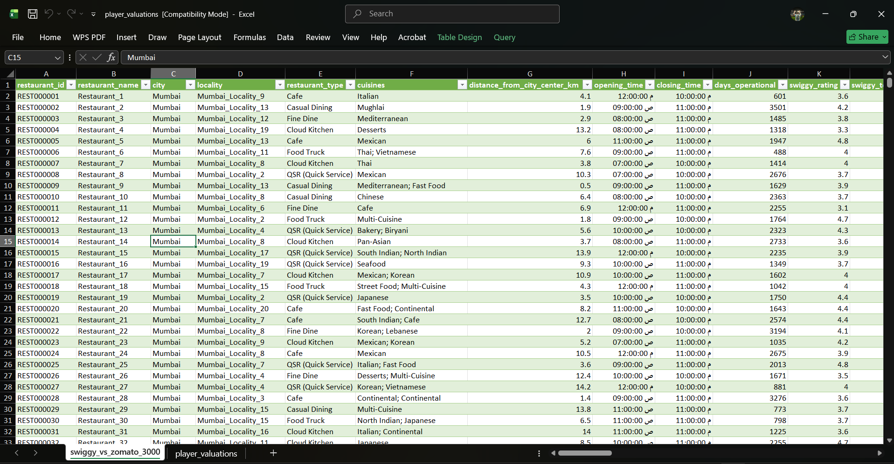
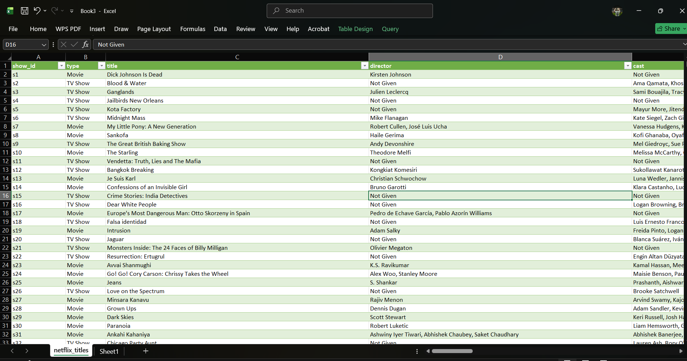

# Excel-Data-Analysis-Projects
# 📊 Advanced Excel Data Analysis - تحليلات إكسيل المتقدمة

This repository showcases my projects using Microsoft Excel for data cleaning, Pivot Tables, and business insights.
هنا أستعرض مشاريعي في تحليل البيانات باستخدام مهارات إكسيل المتقدمة، الجداول المحورية، واستخراج المؤشرات المالية.

## 🛒 Projects | المشاريع

### 1️⃣ Zomato vs Swiggy Sales Performance Analysis | تحليل أداء مبيعات منصات توصيل الطعام 🛒

* **📌 Project Overview | عن المشروع:**
  * **English:** A data analytics project focused on evaluating and comparing the sales performance, customer preferences, and business metrics of two major food delivery giants (Zomato & Swiggy). Using advanced spreadsheet techniques, I processed raw transactional data to extract actionable commercial insights.
  * **عربي:** مشروع تحليل مبيعات متقدم يهدف إلى تقييم ومقارنة أداء المبيعات وسلوك المستهلكين والمؤشرات التجارية لأكبر منصتين في قطاع توصيل الطعام (Zomato و Swiggy). باستخدام تقنيات الجداول المحورية والمعادلات، قمت بمعالجة البيانات الخام لاستخراج رؤى تدعم نمو المبيعات.

* **⚙️ Analytical Techniques Used | المهارات والتقنيات المستخدمة:**
  * **Data Aggregation & Pivot Tables:** Built dynamic pivot tables to summarize total revenue, order counts, and performance metrics per platform.
  * **الجداول المحورية:** بناء جداول محورية ديناميكية لتلخيص إجمالي الإيرادات، وأعداد الطلبات، ومقارنة معدلات النمو بين المنصتين.
  * **Advanced Formatting:** Applied customized visual presentation rules to highlight the top-performing operational zones ("The Kings of Sales").
  * **التنسيق المتقدم:** تطبيق قواعد التنسيق البصري لإبراز المناطق الجغرافية الأكثر تحقيقاً للأرباح وتحديد الفروق الجوهرية في الأداء.

* **📊 Core Insights Extracted | أهم الرؤى المستخرجة:**
  * Identified which platform dominates total sales volume and revenue generation.
  * مقارنة مباشرة وحاسمة لمعرفة أي المنصتين تستحوذ على الحصة السوقية الأكبر وحجم الطلبات اليومي.
  * Analyzed geographic distribution to pinpoint the highest-earning regions for business scaling.
  * تحديد المناطق الجغرافية الأعلى إنتاجية للطلب ومقارنة سلوك العملاء في كل منطقة للاستفادة منها في خطط التسويق.

* **📸 Project Preview | معاينة المشروع:**

### 📸 Project Preview | معاينة المشروع

---

### 2️⃣ Netflix Data Cleaning Project | مشروع تنظيف بيانات نتفليكس 🎬

* **📌 Project Overview | عن المشروع:**
  * **English:** This project focuses on the crucial phase of data analysis: **Data Cleaning**. Using a raw dataset from Kaggle containing Netflix titles, I performed comprehensive data cleaning to prepare it for accurate analysis.
  * **عربي:** يركز هذا المشروع على أهم مرحلة في تحليل البيانات وهي **تنظيف البيانات (Data Cleaning)**. باستخدام بيانات خام من Kaggle لـ Netflix، قمت بمعالجتها وتصحيح الأخطاء لجعلها جاهزة للتحليل.

* **🧽 Cleaning Steps Performed | خطوات التنظيف:**
  * **Handling Missing Values:** Replaced empty cells in critical columns like `director` and `cast` with **"Not Given"**.
  * **معالجة القيم المفقودة:** تم رصد خلايا فارغة في أعمدة المخرجين والممثلين واستبدالها بعبارة **"Not Given"** لتوحيد البيانات.
  * **Removing Duplicates:** Scanned and removed any duplicated records using `show_id`.
  * **إزالة التكرار:** فحص المعرفات الفريدة للتأكد من عدم تكرار أي صف.

* **📸 Project Preview | معاينة المشروع:**

